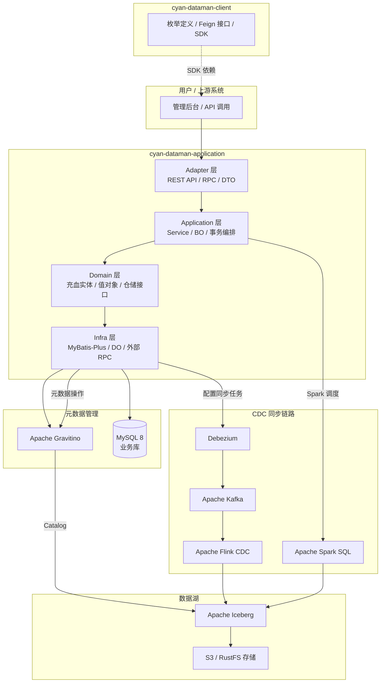

# cyan-dataman

<p align="center">
  <a href="#"></a>
  <a href="#"></a>
  <a href="#"></a>
  <a href="#"></a>
  <a href="#"></a>
  <a href="#"></a>
  <a href="#"></a>
  <a href="#"></a>
</p>

`cyan-dataman` 是 **Cyan** 组织下的数据采集与元数据管理平台，基于 **DDD（领域驱动设计）分层架构** 构建，致力于打通从关系型数据库到数据湖的完整 CDC（变更数据捕获）链路，并提供企业级元数据目录管理能力。

---

## 📖 项目简介

在数据驱动的业务场景中，`cyan-dataman` 承担以下核心职责：

- **数据源治理**：统一管理 MySQL、PostgreSQL、Iceberg 等多类型数据源的连接配置、库表结构查询与 SQL 执行。
- **元数据目录**：通过 Apache Gravitino 构建统一元数据目录，支持主题三级层级分类、表/字段/索引全生命周期管理。
- **CDC 数据入湖**：基于 Debezium + Kafka + Flink CDC 将源库实时变更同步至 Apache Iceberg 数据湖，支持 Spark SQL 与 Flink 双引擎调度，内置时间旅行（Time Travel）与表维护能力。
- **关联关系图谱**：自动记录与分析数据表之间的 JOIN 关联关系，形成可视化的血缘与关系图谱。

---

## 🏗 架构图



---

## 📦 模块说明

| 模块 | 说明 |
|------|------|
| `cyan-dataman-application` | **主应用模块**，Spring Boot 可执行 JAR，包含完整的 adapter / application / domain / infra 四层架构实现，提供 REST API、RPC 接口、CDC 任务调度与元数据管理。 |
| `cyan-dataman-client` | **客户端 SDK 模块**，对外暴露枚举定义与 Feign 接口，供其他服务通过 Maven 依赖集成。无业务逻辑，仅作契约层。 |

### 分层职责

```
cyan-dataman/
├── cyan-dataman-client/                  # 客户端 SDK
│   └── src/main/java/com/cyan/dataman/
│       ├── MetadataTableClient.java      # 元数据表客户端接口
│       └── enums/                        # 全量枚举（DatasourceType、SyncTool、JobStatus 等）
│
└── cyan-dataman-application/             # 主应用（Spring Boot）
    └── src/main/java/com/cyan/dataman/
        ├── Application.java              # 启动类
        ├── adapter/                      # 适配层：HTTP 控制器、DTO、AdapterConvert
        ├── application/                  # 应用层：Service、BO、Cmd、AppConvert、事件调度
        ├── domain/                       # 领域层：充血实体、值对象、仓储接口、Query
        └── infra/                        # 基础设施层：仓储实现、DO、Mapper、配置、工具类
```

| 层级 | 职责 | 透出对象 |
|------|------|---------|
| **adapter** | HTTP/RPC 请求入口，参数校验与 DTO 组装 | DTO |
| **application** | 业务流程编排、事务控制、领域服务调用、异步事件发布 | BO |
| **domain** | 充血领域模型（属性 + 业务行为）、定义仓储接口与 Query | Domain Entity |
| **infra** | 仓储实现、MyBatis-Plus Mapper、DO、外部 RPC、工具类 | DO |

---

## 🛠 技术栈

### 基础框架

| 技术 | 版本 | 说明 |
|------|------|------|
| Java | 21 | 运行基座 |
| Spring Boot | 3.3.13 | Web 容器与自动配置 |
| MyBatis-Plus | 3.5.7 | ORM 增强 |
| MySQL Connector | 8.3.0 | 数据库驱动 |
| Lombok | 1.18.42 | 样板代码削减 |
| MapStruct | — | 编译期类型安全转换 |
| Maven | 3.x | 构建与依赖管理 |

### 大数据生态

| 技术 | 版本 | 说明 |
|------|------|------|
| Apache Iceberg | 1.10.1 | 开放表格式，支持 Time Travel |
| Apache Spark | 4.0.2 (Scala 2.13) | Spark SQL 批处理同步 |
| Apache Flink | 2.0.1 | 流式 CDC 同步引擎 |
| Apache Kafka | — | Debezium 变更事件总线 |
| Debezium | — | CDC 采集器 |
| Apache Gravitino | 1.1.0 | 统一元数据目录服务 |
| Hadoop AWS | 3.4.1 | S3A 文件系统适配 |

### 内部公共库

| 依赖 | 说明 |
|------|------|
| `cyan-arch` (`arch-common` / `arch-base`) | 统一响应 `Response<T>`、分页 `Page<T>`、断言 `Assert`、静默异常 `SilentException`、MapStruct 通用转换器、用户上下文 `UserContextHolder` |
| `cyan-bigdata-base` | 大数据基础 Starter |
| `cyan-employee-login` | 员工登录与上下文拦截 |
| `cyan-datagateway-client` | 数据网关客户端 |

---

## ✨ 核心功能

### 1. 数据源管理（ds）
- 多数据源连接配置管理（MySQL、PostgreSQL、Iceberg）
- 数据库/表结构实时查询、建库、表变更（DDL）
- 在线 SQL 执行与结果回显

### 2. 元数据管理（metadata）
- **主题三级层级**：通过 `Subject` 对数据表进行业务分类（`level = 1/2/3`）
- **元数据目录**：集成 Apache Gravitino 作为统一 Catalog，管理表、字段、索引元信息
- **关联关系图谱**：自动记录表间 JOIN 关系，构建数据血缘图谱

### 3. CDC 数据入湖（cdc）
- **双引擎同步**：
  - **Spark SQL**：基于 Cron 表达式的定时批量同步（`OVERWRITE` / `APPEND`）
  - **Flink + Debezium + Kafka**：实时流式 CDC，捕获源库变更并写入 Iceberg
- **任务状态追踪**：`PENDING → RUNNING → SUCCESS / FAILED / STOPPED`
- **Iceberg 表维护**：每日零点自动执行过期快照清理、小文件合并、孤儿文件删除

### 4. 时间旅行（Time Travel）
- 基于 Iceberg 快照机制，支持查询任意历史时刻的表数据
- 元数据层面完整记录每次变更，便于数据回溯与审计

---

## 🚀 快速开始

### 环境要求

- JDK 21+
- Maven 3.8+
- MySQL 8.x
-（可选）Nacos、Gravitino、Kafka、Flink、Spark 集群

### 编译构建

```bash
# 克隆仓库
git clone <仓库地址>
cd cyan-dataman

# 全量构建（跳过测试）
mvn clean package -DskipTests

# 仅构建 application 模块及其依赖
mvn clean package -pl cyan-dataman-application -am -DskipTests
```

### 运行服务

```bash
# 本地启动（dev 环境）
java -jar cyan-dataman-application/target/cyan-dataman.jar \
  --spring.profiles.active=dev
```

> 开发环境配置位于 `cyan-dataman-application/src/main/resources/bootstrap-dev.yml`，需确保 Nacos、MySQL、Gravitino、Kafka 等地址可访问。

### 部署到 Maven 私服

在 `~/.m2/settings.xml` 中配置 `maven-releases` / `maven-snapshots` 认证后执行：

```bash
mvn clean deploy -DskipTests
```

---

## 📄 API 概览

- 对外 REST API 基础路径：`/api/v1`
- 内部 Agent/RPC 基础路径：`/rpc/v1`
- 统一响应格式：`Response<T>`
- 分页格式：`Page<T>`

示例端点：

| 方法 | 路径 | 说明 |
|------|------|------|
| `POST` | `/api/v1/ds` | 创建数据源 |
| `GET` | `/api/v1/ds` | 数据源列表 |
| `GET` | `/api/v1/metadata/tables` | 元数据表列表 |
| `POST` | `/api/v1/cdc/configs` | 创建 CDC 同步配置 |
| `GET` | `/rpc/v1/agent/meta/tables` | 内部 RPC：元数据表查询 |

---

## ⚠️ 注意事项

- 本项目当前**无测试代码**，构建时请始终携带 `-DskipTests`。
- 生产环境请收缩 Actuator 端点暴露范围（当前配置为 `*`）。
- SQL 执行接口需在上层做好权限管控，避免误操作生产库。
- 生产环境配置（`bootstrap-prod.yml`）包含敏感连接信息，请勿泄露。

---

## 📄 License

© Cyan Team. All rights reserved.
